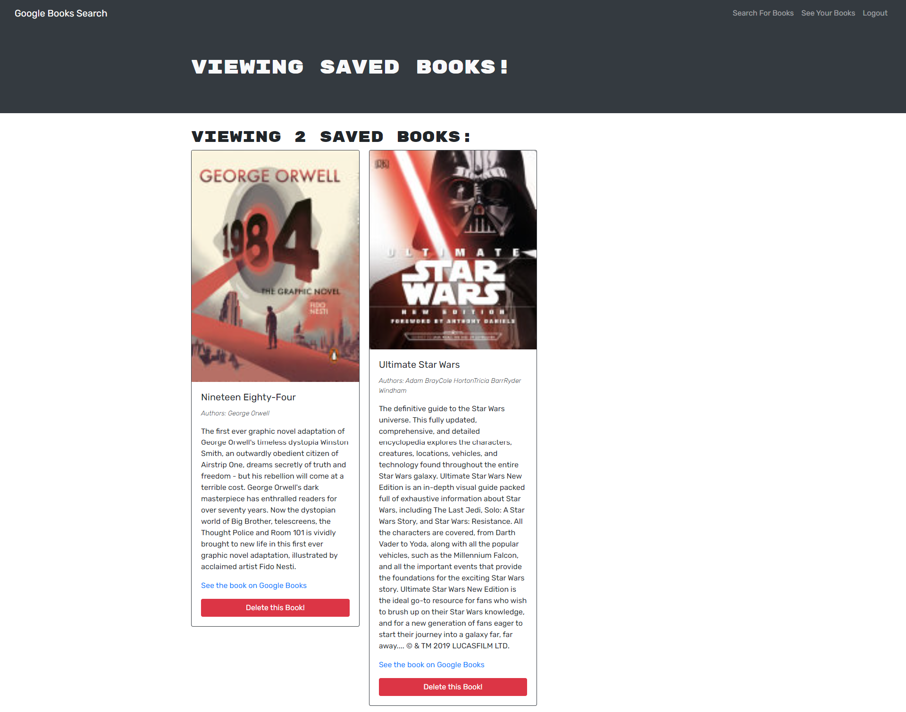

# book-search-engine

## Table of Contents

- [Description](#description)
- [Visuals](#visuals)
- [Resources](#resources)

## Description

Book search application that uses the Google Books API. Features login/logout/signup functionality. Allows for users to search for books, and save titles they would like to view later, or delete previously saved books from their saved books.

## Visuals

## Resources

[Repository](https://github.com/Bureizu742/book-search-engine)

[Deployed Site](https://whispering-stream-06136.herokuapp.com/)